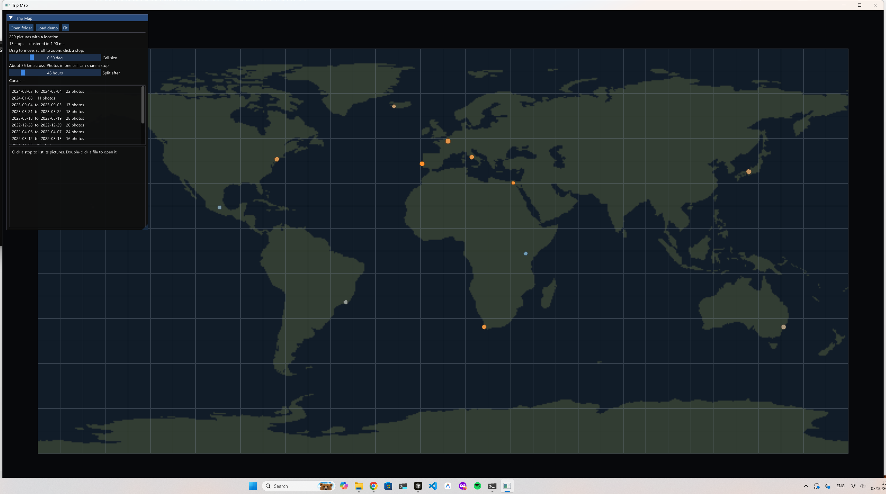

# Trip Map

A map of the pictures on your disk. Point it at a folder and every photo that has a GPS location
becomes a dot. Shots from the same place, close together in time, collapse into one stop: a weekend
in one city, rather than a pile of files named `IMG_3041`.

The grouping runs on the GPU, the same way the digital-ecosystem simulation bins its creatures.
One thread per photo builds a cell key from latitude and longitude, CUB sorts those keys, and a
scan turns time gaps into visits.



## Run

```powershell
.\build.ps1                 # release build -> build\release\tripmap.exe
.\build.ps1 -Run --demo     # build and open a sample world of trips
.\build.ps1 -Run -- "D:\Pictures"
```

Or open a folder from the window. JPEG and TIFF are read from the EXIF header. HEIC, PNG, WEBP and
common camera RAW formats go through Windows, so HEIC needs the [HEIF Image Extension](https://apps.microsoft.com/detail/9pmmsr1cgpwg) from the Store.

Drag to move the map, scroll to zoom, click a stop. `F` fits the pictures in view. A stop lists
its files; double-click one to open it.

The **cell size** is how wide a "same place" is (about 111 km per degree). **Split after** is the
quiet gap that starts a new visit, so a return to the same city next year does not merge with this one.

Dates are the clock stored in the file, with no timezone conversion.

```powershell
.\build\release\tripmap.exe --self-test
```

## How a folder becomes stops

```
read GPS  ->  key = map cell and time  ->  radix sort  ->  flag time gaps  ->  scan  ->  one row per stop
```

| Path | What it is |
|---|---|
| `src/photos.cpp` | Folder walk, EXIF GPS, Windows property handler for HEIC and RAW |
| `src/tripmap.cu` | Keys, CUB sort, visit scan, map and stop drawing into an OpenGL texture |
| `src/landmask.cpp` | 720×360 land mask, from Natural Earth 110m (public domain) |
| `src/main.cpp` | Window, camera, folder dialog, stop list |
| `tools/make_landmask.py` | Regenerates the land mask |

Cells are quantized degrees, not a hash of the whole planet, so the sort input is just one 64-bit
key per photo: the cell in the high half, the timestamp in the low half. Photos with no date form
their own visit instead of sticking to whichever dated shot shares the cell.

## Build requirements

- An NVIDIA GPU. The build targets `sm_86` (RTX 30xx) by default.
- CUDA Toolkit 12.x, with `CUDA_PATH` set.
- CMake 3.24 or newer, and [Ninja](https://github.com/ninja-build/ninja).
- MSVC C++ build tools (Visual Studio 2019 or 2022).

`build.ps1` finds `vcvarsall.bat` and configures the presets in `CMakePresets.json`. GLFW and
Dear ImGui are downloaded by CMake the first time. For another GPU, configure with
`-DCMAKE_CUDA_ARCHITECTURES=native`, or `89` for the RTX 40xx series.
